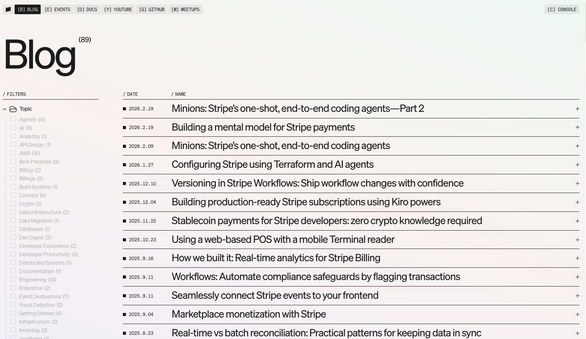
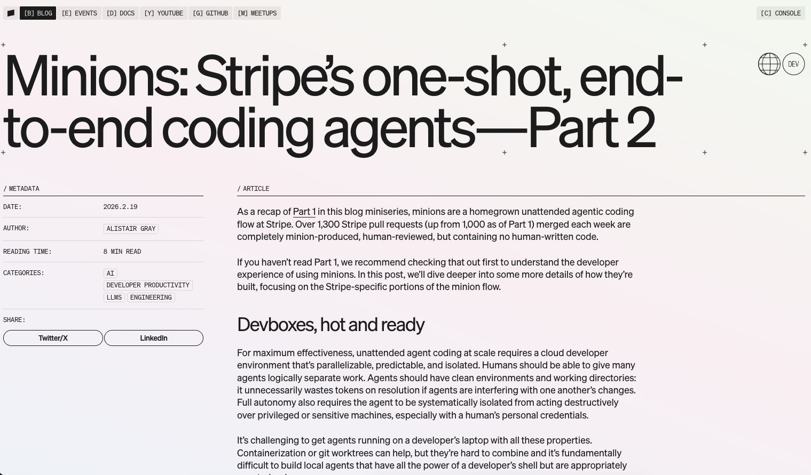
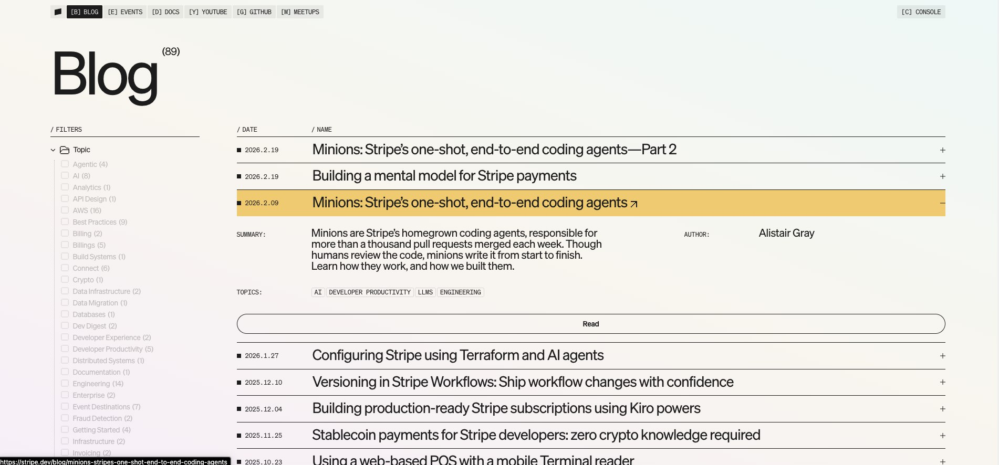

# PRD - Blog 重新設計

## 目標
將 frankly-speaking 的部落格頁面重新設計，採用現代卡片式 UI，類似 OpenClaw subagent 列表的風格。

---

## 現有問題
- 部落格列表過於陽春
- 只有文字連結，無圖片預覽
- 缺乏視覺層次

---

## 功能需求

### F1: 部落格列表卡片
- [ ] 卡片式文章預覽
- [ ] 顯示文章標題、日期、摘要
- [ ] **點擊 + 展開顯示 Summary 和 Tags**
- [ ] 懸停效果（陰影/放大）
- [ ] RWD 響應式（手機/平板/桌面）

### F2: 文章詳情頁
- [ ] 乾淨的閱讀體驗
- [ ] 程式碼區塊 syntax highlighting
- [ ] 返回列表按鈕

### F3: 分類/標籤（可選）
- [ ] 文章分類顯示
- [ ] 標籤過濾

---

## UI 風格參考

**參考網站**: https://stripe.dev/blog

截圖參考：
- 
- 
- 

風格：
- 卡片式佈局
- 圓角邊框
- 柔和陰影
- 間距整齊
- 色彩簡潔

---

## 技術限制

### 技術棧變更
- [ ] **移除 styled-components**
- [ ] **改用 Tailwind CSS**
- [ ] **使用 Headless UI 加速開發** (https://headlessui.com/)

### 調研任務
- [ ] 評估合適的 Headless UI Library
- [ ] 評估程式碼高亮方案
- [ ] 部落格列表頁面美觀
- [ ] 文章詳情頁閱讀體驗佳
- [ ] 手機版正常顯示
- [ ] 現有文章正常顯示
